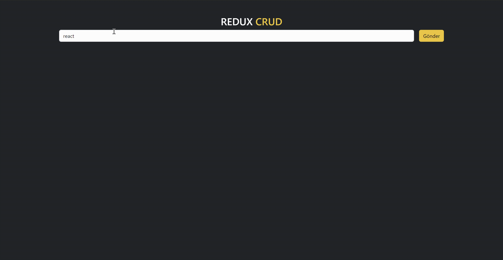

## State Yönetimi

- State: Uygulamadaki bilesenlerin sahip oldugu bilgi ve özellikler

- Prop Drilling: Bileşenlerin yukarıdan asagıya veri tasımasıdır.

- Context: Uygulamadaki state i bütün bilesenler tarafından erisilebilen ve olusturdugumuz merkezlerden yönettiğimiz state yönetim aracidir

- Redux: Bilesenlerin sahip oldugu ve merkezi olarak tutulması gereken state lerin yönetildiği merkezi state yönetim aracıdır

## Neden Contex yerine Redux Kullanırız?

- Kod tekrarını önler

- performansı daha iyidir

- Bileşen içerisindeki karışıklığı azaltır

- Hata ayıklama daha kolaydır

- Orta ve büyük projelerde state yönetimini daha kolay hale getirir

## Redux ile ilgili bilinmesi gerekenler

1. Store: Uygulamanın bütün bileşenleri tarafından erişilebilen ve yönetilebilen state deposu

2. Reducer: Aksiyondan aldıgı talimata göre store'da tutulan state in nasıl değisecegine karar veren fonksiyon

3. Action: Store'daki state i güncellemek icin reducer'a gönderdiğimiz nesnedir.

- - Action iki degere sahip bir nesnedir:

- type(zorunlu) : Action un görevini tanımlayan string

- payload(opsiyonel): Action 'ın verisi

4. Dispatch(Sevketmek): Action 'ın gerceklestiğini reducer'a haber veren method

## Redux kurum Aşamaları

- "redux" ve "react-redux " paketleri indirilir(npm i redux react-redux)

## GIF

